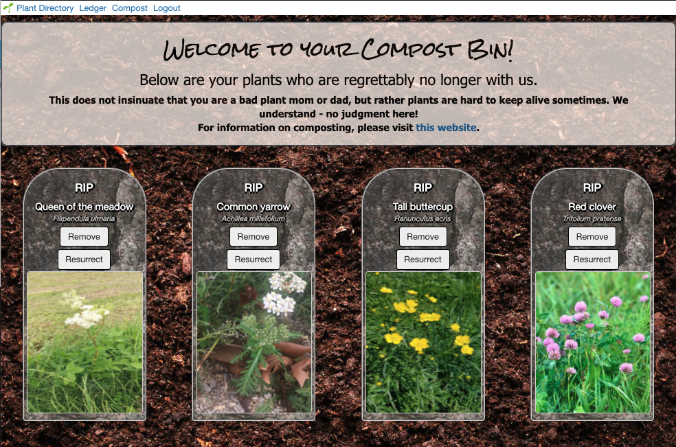

# Leafy Ledger

Plants brighten up your house, provide a warm, inviting atmosphere, and are shown to boost moods, reduce stress, circulate oxygen, among many other things. However, if you've ever owned plants, you know that it may be difficult to cultivate them and keep them alive. Each plant is unique with different preferences when it comes to climate, sunlight, and water intake. It is also very easy to forget when the last time you watered or repotted your plants.
 
That's where Leafy Ledger comes in!
 
Our app allows you to access information about your favorite plants and track how often you have watered them. Accessing a vast database, you also can view plants that you are interested in, see if housing them would be a good fit for you, and bookmark them for later. Fret no more about your watering schedules and let Leafy Ledger help you with your plant friends!

## Motivation
The goal of this collaboration was to create an user-friendly application that would practical in the everyday lives of potential users. 

## Technologies Used

*HTML
*CSS
*Javascript
*Express
*EJS
*EJS-Layouts
*Express-Passport
*Axios
*SQL
*Sequelize

##### Screenshot(s) 

## ERD, Wireframe, & User Stories

*	As a user I want to log in via email and password to access my Leafy Ledger.
*	As a user I will browse the catalogue of plants on the main page that displays content from the Trefle.io API.
*	From the main page I will be able to add plants to my ledger, click on plants to view more details about plants, and navigate to my ledger.
*	From the details page, I will be able to favorite plants I am currently viewing or navigate back to main page or my ledger.
*	I will access my ledger to view or delete favorited plants.
* If plants die, I can send them to my compost bin (plant cemetery).
* From the compost bin, I can sent my plants to hell (delete the association) or I can ressurect them in the event that they serendipitously come back to life.
*	For plants that I own, I can add and update information about when I last watered my plants.
*	As a user, I can also view additional fun facts about the plants I favorited from my ledger.
* As a user, I can also

## Future Development

* In the future the the dead plant button function will change to toggle true/false for dead attribute on server database. Deadplants will be grayscaled and user can view past plants in their dead plant cemetery.
*	From the ledger, the user will be able to click on a calendar icon to view the cumulative history of waterlogs.
*	In the future, the user will be able to include information about soil type.
*	The user will be able to search the main catalogue to find specific plants.
*	The user will be able to unfavorite a plant using the hot button on the plant directory page.
*	The hot button will detect if there is data stored for last watered or soil type and pop a modal warning before deletion.

